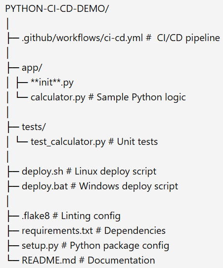

# Python CI/CD Demo (GitHub Actions)

This repository demonstrates a complete CI/CD pipeline for a Python project using GitHub Actions.

It performs:

- Automatic code formatting using **Black** and **isort**
- Code linting with **Flake8**
- Unit testing with **Pytest**
- Cross-platform deployment using `.sh` scripts for Linux and `.bat` scripts for Windows

This project is designed to help understand real-world CI/CD workflows for Python applications.

# Project Structure

|  |

# CI/CD Stages in Github actions

| Stage                | Tool                       | Purpose                  |
| -------------------- | -------------------------- | ------------------------ |
| Install dependencies | pip                        | Setup environment        |
| Auto-format          | Black, isort               | Fix code style           |
| Lint                 | Flake8                     | Enforce coding standards |
| Test                 | Pytest                     | Validate functionality   |
| Deploy               | `deploy.sh` / `deploy.bat` | Demo deployment          |

## Viewing CI/CD Pipeline in GitHub Actions

To view your pipeline execution:

### Option 1: From the Repository Menu

1. Go to your repository on GitHub.
2. Click the **Actions** tab in the top navigation.
3. Select a workflow run (for example, _Python CI/CD Pipeline_).
4. Click each step to view logs and output.

Here you can review build logs, test results, formatting auto-commits, deployment logs, and more.

### Option 2: Per Commit or Pull Request

1. Open any **commit** or **pull request**.
2. Look for the status icons that indicate success, failure, or pending checks.
3. Click **Details** to open the corresponding Actions logs.

This is how DevOps engineers debug pipelines in real-world projects.

## Run Locally

```bash
python -m venv venv
source venv/bin/activate     # On Windows: venv\Scripts\activate
pip install -r requirements.txt
pip install -e .
```

## Formate code

```Bash

black .
```

## Lint

```Bash

flake8 .
```

## Run Test

```Bash

pytest
```

From writing Python code → to testing → to deployment — all automated!

Thanks !!

Shraddha
